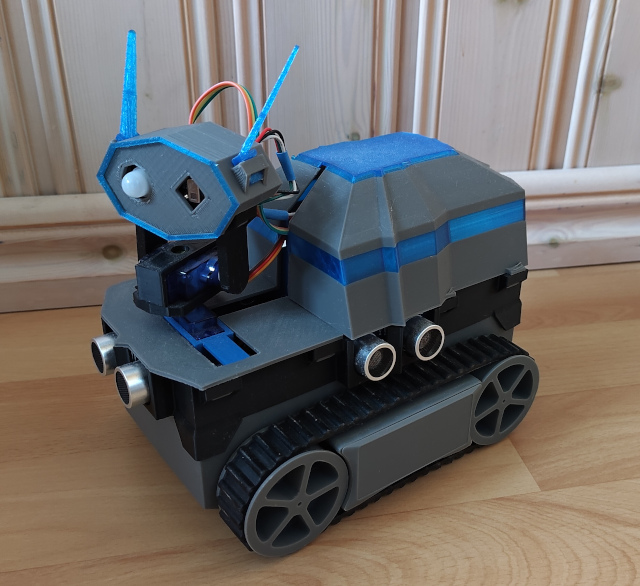

# Peek-a-boo
A mobile robot that like to play hide-n-seek with you or just
follow you around.

More technically, it will use a heat camera to detect humans
and ultrasonic sensors for navigating a flat surface with obstacles.
If left unattended it will go to asleep and awoken by a PIR sensor.

## Hardware parts
* Crawler: wheel base with motors and battery pack
* Microcontroller: [Raspberry Pi Pico H](https://www.raspberrypi.com/documentation/microcontrollers/pico-series.html#pico-1-family) ([pinout](https://www.raspberrypi.com/documentation/microcontrollers/images/pico-pinout.svg))
* Heat camera: AMG8833 ([library](https://github.com/peterhinch/micropython-amg88xx))
* Motor/servo shield: [Kitronik Robotics Board](https://github.com/KitronikLtd/Kitronik-Pico-Robotics-Board-MicroPython) ([pinout](https://kitronik.co.uk/cdn/shop/products/5329_additional-1-kitronik-robotics-board-for-raspberry-pi-pico_800x.jpg))
* Servo motors: 2 x SG90
* Movement detection: PIR [SR505](https://hobbycomponents.com/sensors/1066-sr505-miniature-pir-sensor-module) **\***
* Ultrasonic sensors: 4 x HC-SR04
* Sound: Passive piezo buzzer
* Power switch: Toggle switch
* Body parts: [see more here](body-parts/README.md)

**\*** SR505 needs 5-12V to behave correctly, and the Robotics Board supply only 3.3V for peripherals, so *VIN* connected directly to the battery PIN.

## Software
I started using *Thonny*, but ended up using *Visual Studio Code* with extension `MicroPico`.

Upload content in folder `app` into root of the microcontroller. (VSCode command `MicroPico: Upload project to Pico`)

## Limitations and room for improvements
The head will focus on the warmest thing in view, which works pretty well.
However, the "human detection" is very simplistic; if the center of the heat
camera's image has an average temperature above 25 degrees it's a hit.
It's not much you can do with a 8x8 pixel image, but some form of shape
recognition would be possible.

Navigation is pretty much drive forward-ish (where the head points) until too
close to something, then turn away from obstacle, repeat.
The ultrasonic sensors may be good at determine the distance, but it's hard to
tell the angle to the obstacle. And with only four of them, it leaves several
dead angles. Though, some form of obstacle heat map or SLAM would still be possible.

## Abandoned paths
I've been intrigued to use AI, and the Pico should be strong enough handle small models.
However, TensorFlow Lite in conjuction with MicroPython posed a too great challenge at the moment.

Also considered using *Pico 2 W* and connect a Bluetooth gamepad for manual driving,
which would have come handy in generating training data for a model. However,
at the moment native Bluetooth support is very limited.
