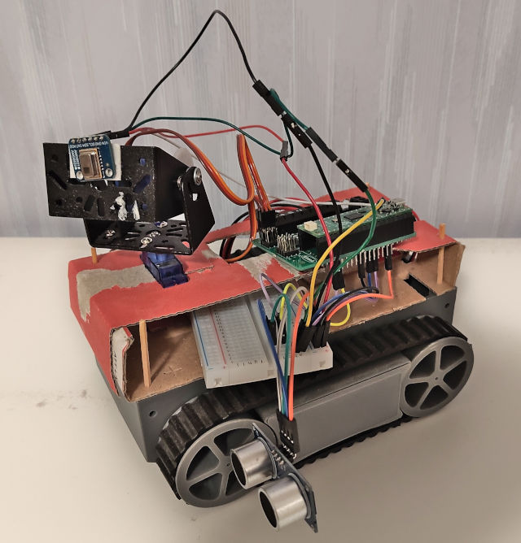

# Peek-a-boo
A mobile robot that like to play hide-n-seek with you or just
follow you around.

More technically, it will use a heat camera to detect humans
and ultrasonic sensors for navigating a flat surface with obstacles.
If left unattended it will go to asleep and awoken by a PIR sensor.

**NOTE** *This very early in development, it does currently not work as intended*

## Parts
* Controller: [Raspberry Pi Pico H](https://www.raspberrypi.com/documentation/microcontrollers/pico-series.html#pico-1-family) ([pinout](https://www.raspberrypi.com/documentation/microcontrollers/images/pico-pinout.svg))
* ~~Display: SH1107, https://github.com/peter-l5/SH1107~~
* Heat camera: AMG8833, https://github.com/peterhinch/micropython-amg88xx
* Motor/servo shield: Kitronik Robotics Board, https://github.com/KitronikLtd/Kitronik-Pico-Robotics-Board-MicroPython
* Servo motors: 2 x SG90
* Movement detection: PIR
* Ultrasonic sensors: 4 x HC-SR04
* Sound: Passive piezo buzzer

## IDE
Either works:
* Visual Studio Code - extension `MicroPico`
* Thonny: `pip3 install thonny -U`

## Deploy software
Upload `lib/` and `main.py` into root of the Pico controller.
