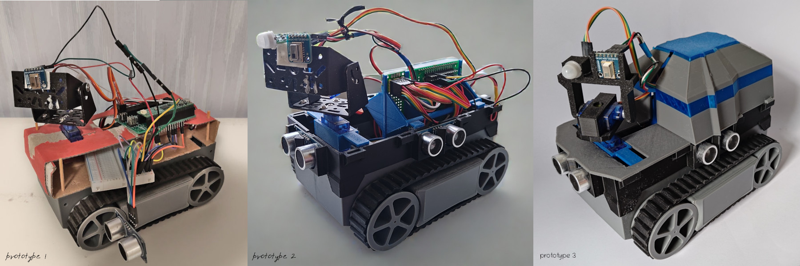

# Peek-a-boo
**NOTE** *Very early in development, it does currently not work as intended*

A mobile robot that like to play hide-n-seek with you or just
follow you around.

More technically, it will use a heat camera to detect humans
and ultrasonic sensors for navigating a flat surface with obstacles.
If left unattended it will go to asleep and awoken by a PIR sensor.

## Parts
* Crawler: wheel base with motors and battery pack
* Microcontroller: [Raspberry Pi Pico H](https://www.raspberrypi.com/documentation/microcontrollers/pico-series.html#pico-1-family) ([pinout](https://www.raspberrypi.com/documentation/microcontrollers/images/pico-pinout.svg))
* Heat camera: AMG8833 ([library](https://github.com/peterhinch/micropython-amg88xx))
* Motor/servo shield: [Kitronik Robotics Board](https://github.com/KitronikLtd/Kitronik-Pico-Robotics-Board-MicroPython) ([pinout](https://kitronik.co.uk/cdn/shop/products/5329_additional-1-kitronik-robotics-board-for-raspberry-pi-pico_800x.jpg))
* Servo motors: 2 x SG90
* Movement detection: PIR [SR505](https://hobbycomponents.com/sensors/1066-sr505-miniature-pir-sensor-module) **\***
* Ultrasonic sensors: 4 x HC-SR04
* Sound: Passive piezo buzzer
* Power switch: Toggle switch
* Body parts: [see more here](body-parts/README.md)

**\*** SR505 needs 5-12V to behave correctly, and the Robotics Board supply only 3.3V for peripherals, so *VIN* connected directly to the battery PIN.

## IDE
Either works:
* Visual Studio Code - extension `MicroPico`
* Thonny: `pip3 install thonny -U`

## Deploy software
Upload content in folder `app` into root of the microcontroller. (VSCode command `MicroPico: Upload project to Pico`)

## Abandoned paths
I've been intrigued to use AI, and the Pico should be strong enough handle small models.
However, TensorFlow Lite in conjuction with MicroPython posed a too great challenge at the moment.

Also considered using *Pico 2 W* and connect a Bluetooth gamepad for manual driving,
which would have come handy in generating training data for a model. However,
at the moment native Bluetooth support is very limited.
