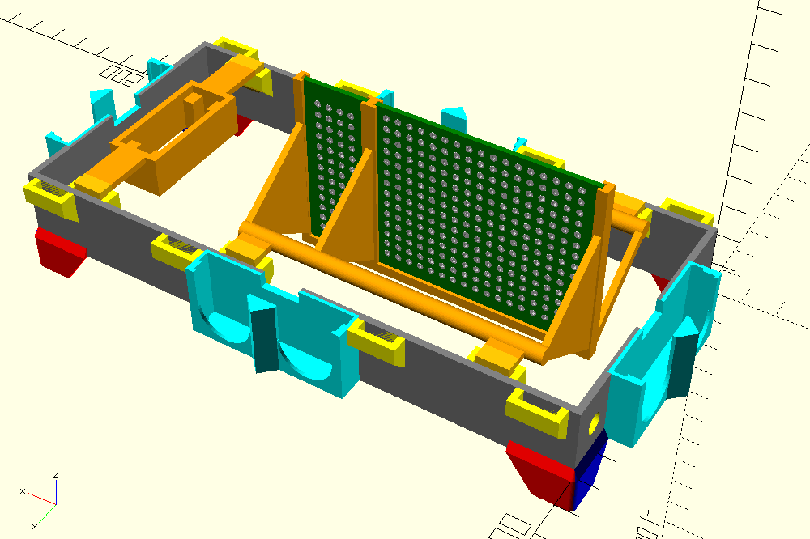
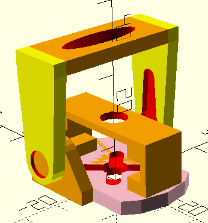
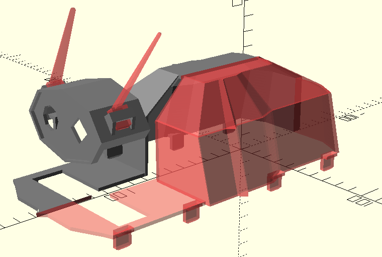

# Body parts - 3D-printable
These models are made using OpenSCAD.

## Base / inside

* **Grey** base frame (`base.scad`)
* **Red/blue** snap-on to crawler (`base_clip.scad`)
* **Aqua** ultrasonic holders (`ultrasonic-holder.scad`)
* **Yellow** addon holders (`addon_support.scad`)
* **Orange** addons for servo motor and PCBs (`addon_servo.scad`, `addon_shield.scad`)
* **Green** PCBs just for illustration (`pcb.scad`)

## Head
Servo-tilt with sockets for the heat camera and the PIR sensor.
Also addon holders for exterior case.

* **Yellow/blue** tilt/pitch frame with heat camera and PIR mount (`head_tilt.scad`)
* **Orange/pink** base/yaw holder for frame (`head_base.scad`)

## Chassi / outside
Will go into the outer addon holders.

