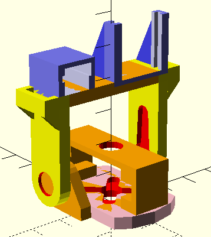

# Body parts - 3D-printable
These models are made using OpenSCAD.

## Base / inside

* **Grey** base frame
* **Red/blue** snap-on to crawler
* **Aqua** ultrasonic holders
* **Yellow** addon holders
* **Orange** addons for servo motor and PCBs
* **Green** PCBs just for illustration

## Head
Just a servo-tilt for now.
Will later have sockets for heat camera and PIR
and addon holders for exterior case.

## Chassi / outside
Will go into the outer addon holders.

TODO
