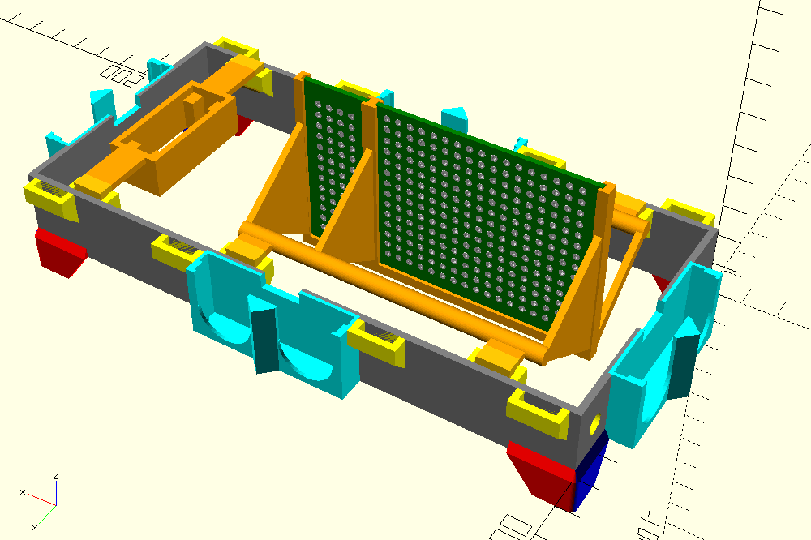

# 3D-printable case
These models are made using OpenSCAD.

## Base / inside
* **Grey** base frame
* **Red/blue** snap-on to crawler
* **Aqua** ultrasonic holders
* **Yellow** addon holders
* **Orange** addons for servo motor and PCBs
* **Green** PCBs just for illustration

## Chassi / outside
Will go into outer addon holders.

TODO
